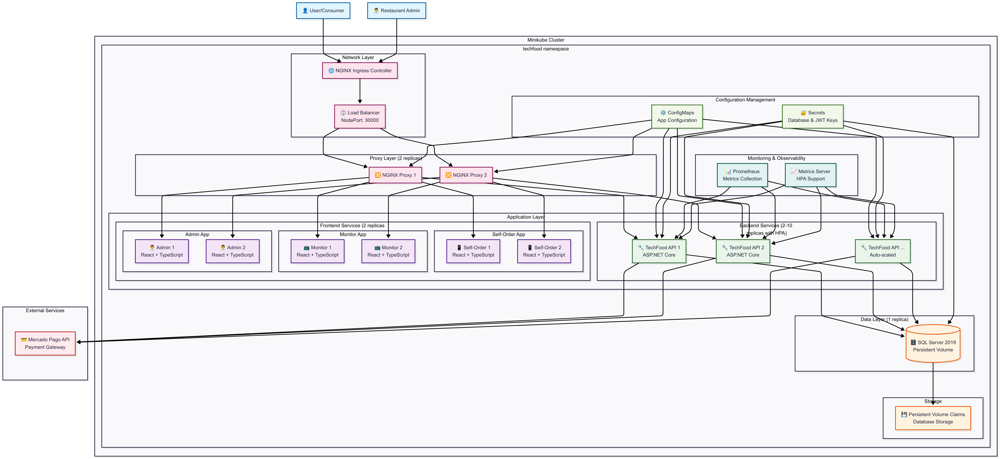
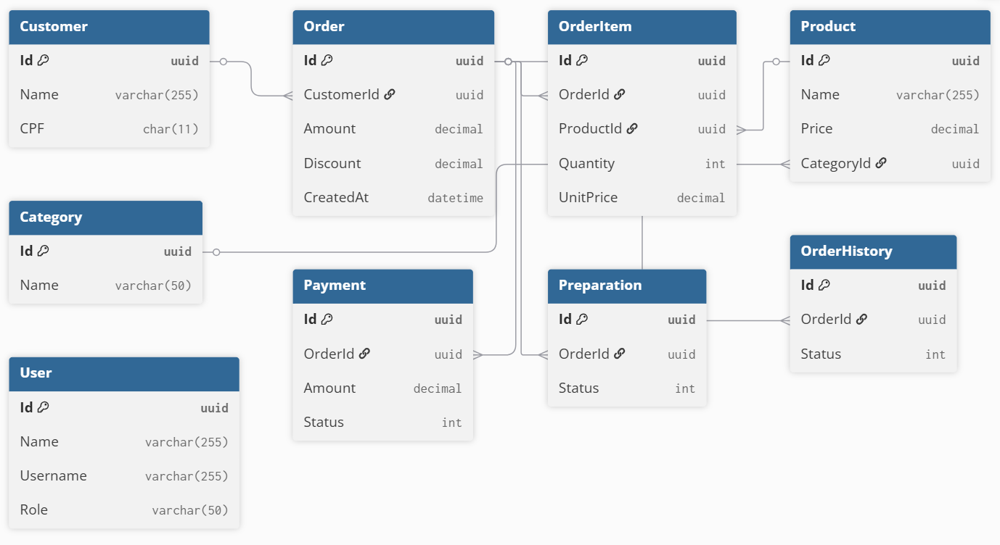

# TechFood

TechFood is a FIAP Post-Graduation project that aims to create a web application for a food delivery service. The project is developed using the dotnet core framework and utilizes the ASP.NET Core MVC architecture. The application is designed to be responsive and user-friendly, providing a seamless experience for both customers and restaurant owner. The project is built with a focus on clean architecture, DDD, and hexagonal architecture principles.

## 📋 Table of Contents

- [Project Presentation](#project-presentation)
- [Brainstorming](#brainstorming)
- [Architecture](#architecture)
- [Technologies Used](#technologies-used)
- [Features](#features)
- [Project Structure](#project-structure)
- [Getting Started](#getting-started)
  - [☸️ Kubernetes Deployment](./k8s/README.md)
  - [🐳 Docker Deployment](./DOCKER.md)
  - [⚡ AWS Lambda Deployment](./LAMBDA-README.md)
- [Configuration](#configuration)
- [API Documentation](#order-flow---swagger)
- [Frontend Flows](#order-flow---frontend)
- [Team Members](#members)

## Project Presentation

[](https://youtu.be/0T7fcPIKPRI)

## Brainstorming

[](https://miro.com/app/board/uXjVIuYTFVc=/)

## Architecture (k8s)

### Solution Architecture

The TechFood application follows a microservices architecture designed to handle the specific business requirements of a food delivery service. The architecture addresses both business needs and infrastructure requirements for scalable deployment.



#### Business Requirements Addressed

The architecture solves the following business problems:

1. **Customer Self-Service Ordering**: Enables customers to browse menus and place orders independently without staff assistance
2. **Real-time Order Management**: Provides restaurant staff with immediate visibility into incoming orders and preparation status
3. **Payment Processing Integration**: Seamlessly integrates with Mercado Pago for secure payment processing
4. **Order Tracking**: Allows customers to monitor their order status in real-time
5. **Multi-tenant Restaurant Support**: Supports multiple restaurants with isolated data and operations

#### Infrastructure Requirements

The solution is designed to run on various Kubernetes platforms:

- **Local Development**: Minikube or Kind for local testing and development
- **Cloud Platforms**:
  - Azure Kubernetes Service (AKS)
  - Amazon Elastic Kubernetes Service (EKS)
  - Google Kubernetes Engine (GKE)
- **Hybrid Cloud**: Can be deployed on any Kubernetes-compliant platform

**Key Infrastructure Components**:

- **Container Orchestration**: Kubernetes for automated deployment, scaling, and management
- **Load Balancing**: NGINX ingress controller for traffic distribution
- **Data Persistence**: SQL Server with persistent volume claims
- **Service Mesh**: Internal service communication via Kubernetes services
- **Monitoring**: Built-in health checks and readiness probes
- **Scalability**: Horizontal pod autoscaling capabilities

## Technologies Used

### Backend

- **ASP.NET Core** - Web API framework
- **Entity Framework Core** - ORM for database access
- **AutoMapper** - Object mapping
- **SQL Server** - Database

### Frontend

- **RadixUI** - UI component library
- **TypeScript** - Type-safe JavaScript
- **React** - Frontend framework
- **HTML/CSS** - Markup and styling

### Infrastructure & DevOps

- **Docker & Docker Compose** - Containerization
- **Kubernetes** - Container orchestration
- **AWS Lambda** - Serverless functions for Authentication and Customer endpoints
- **NGINX** - Reverse proxy and load balancer
- **Minikube** - Local Kubernetes development

### Serverless

- **AWS Lambda** - Serverless compute for specific endpoints
- **API Gateway** - RESTful API endpoint management
- **AWS SAM** - Serverless Application Model for deployment

### Payment Integration

- **Mercado Pago API** - Payment processing

## Features

### Customer Features

- Consumer self-ordering system
- Consumer registration and login
- Menu browsing and item selection
- Order placement and tracking
- Payment integration (Mercado Pago)
- Real-time order status monitoring

### Restaurant Features

- Restaurant registration and login
- Menu management
- Order preparation tracking
- Admin panel for restaurant operations
- Order fulfillment workflow

### Project Structure

The project is organized into several key components:

#### Core Applications

- **SQL Server**: Database that stores all application data (users, restaurants, menus, orders)
- **API**: Backend API built with ASP.NET Core that handles all business logic
- **Self-Order**: Consumer-facing frontend for placing orders (RadixUI + React)
- **Monitor**: Real-time order tracking application for customers
- **Admin**: Restaurant management interface for menu and order management
- **NGINX**: Reverse proxy server for routing requests

#### Deployment & Infrastructure

- **Docker**: Containerization with Docker Compose for local development
- **Kubernetes**: Ready orchestration with Minikube support
- **k8s/**: Kubernetes manifests and deployment scripts
- **nginx/**: NGINX configuration files

## Getting Started

### Quick Start Summary

1. **Clone the repository**

   ```bash
   git clone <repository-url>
   cd tech-challenge/fase1
   ```

You can run this project using different deployment methods:

### ☸️ Kubernetes Deployment

For deployment using Kubernetes (Minikube), see the detailed instructions in:
📖 **[k8s/README.md](./k8s/README.md)**

Follow the guide in [k8s/README.md](./k8s/README.md)

- API Swagger: http://localhost:30000/api/swagger/index.html
- Self-Order App: http://localhost:30000/self-order/
- Monitor App: http://localhost:30000/monitor/
- Admin App: http://localhost:30000/admin/

### 🐳 Docker Deployment

For quick setup using Docker containers, see the detailed instructions in:
📖 **[DOCKER.md](./DOCKER.md)**

`docker-compose up -d` (see [DOCKER.md](./DOCKER.md) for details)

- API Swagger: http://localhost:5000/api/swagger/index.html
- Self-Order App: http://localhost:5000/self-order/
- Monitor App: http://localhost:5000/monitor/
- Admin App: http://localhost:5000/admin/

### ⚡ AWS Lambda Deployment

For serverless deployment of Customer and Authentication endpoints using AWS Lambda, see:
📖 **[LAMBDA-README.md](./LAMBDA-README.md)**

This deployment method provides:

- **Serverless Customer Endpoints**: Create and retrieve customer data
- **Serverless Authentication**: Sign-in functionality
- **Auto-scaling**: Handles traffic spikes automatically
- **Cost-effective**: Pay only for actual usage

Quick deployment:

```bash
# Build and deploy
./build-lambdas.bat  # Windows
./deploy-lambdas.bat # Windows

# Or on Linux/Mac
./build-lambdas.sh
./deploy-lambdas.sh
```

After deployment, access endpoints via API Gateway URL:

- POST `/v1/authentication/signin`
- POST `/v1/customers`
- GET `/v1/customers/{document}`

## Configuration

### Test Credentials

The application comes with pre-configured test credentials for Mercado Pago payment integration:

- **Seller Username**: `TESTUSER1125814911`
- **Seller Password**: `DD1wLKK8sd`
- **Customer Username**: `TESTUSER1370967485`
- **Customer Password**: `ayGV80NpxL`
- **User ID**: `2414323212`
- **Access Token**: `APP_USR-5808215342931102-042817-5d5fee5e46fe9a6b08d17f29e741091f-2414323212`

### Database Connection

The default database connection string used by the API:

**Connection String**: `Server=techfood.db;Database=dbtechfood;User Id=sa;Password=123456#4EA;TrustServerCertificate=True;`

_Note: These credentials are for development/testing purposes only. For production deployments, ensure to use secure credentials and proper environment variable management._

## Order Flow - Swagger

After starting the application, all the endpoints can be tested using Swagger, which is available at the following URL: [http://localhost:5000/api/swagger/index.html](http://localhost:5000/api/swagger/index.html).

**Creating a new order**:

Do a post to endpoint `/v1/orders`:


Obs: to get the `productId`, you can use the endpoint `/v1/products` to list all products. if there is no products, follow the step - **Admin Flow - Swagger**

**Creating a new payment**:

After creating an order, you can create a new payment by doing a post to endpoint `/v1/payments`:


You should get as response the QR code to be scanned by the consumer to complete the payment.


After the payment a weebhook will be called to update the order status to PAID and the preparation status to PENDING.

Obs: The weebhook is not implemented yet so you can call directly the endpoint `/v1/payments/{paymentId}`

**Changing preparation status**:

To change the preparation status, you can do a PATCH to the following endpoints:


- `/v1/preparations/{preparationId}/start` to change the status to INPROGRESS.
- `/v1/preparations/{preparationId}/finish` to change the status to DONE.
- `/v1/preparations/{preparationId}/cancel` to change the status to CANCELLED.

After changing the preparation status to DONE you can finish the order and preparation flow doing a PATCH to the endpoint `/v1/orders/{orderId}/finish`.

## Admin Flow - Swagger

In order to create a new product, first you need to create a catergory by doing a post to endpoint `/v1/categories`:


Then, you can create a new product by doing a post to endpoint `/v1/products`:


## Order Flow - Frontend

1. **Consumer**: The consumer uses the self-order application to browse the menu, select items, and place an order. The order is then sent to the restaurant for preparation:


2. **Restaurant**: The restaurant receives the order through the admin panel, where they can manage the menu and track order preparation and delivery:


# Documentação Banco de Dados

### 1. Modelagem de entidade relacional



### 2. Dicionário de Dados TechFood

| Tabela | Campo | Tipo | Observações |
| --- | --- | --- | --- |
| Customer | Id | UUID (PK) | Identificador único |
| Customer | Name | VARCHAR(255) | Nome do cliente |
| Customer | CPF | CHAR(11) | Documento único |
| Order | Id | UUID (PK) | Identificador do pedido |
| Order | CustomerId | UUID (FK) | Relaciona com Customer |
| Order | Amount | DECIMAL(10,2) | Valor bruto |
| OrderItem | Id | UUID (PK) | Identificador do item |
| OrderItem | ProductId | UUID (FK) | Relaciona com Product |
| Product | Id | UUID (PK) | Identificador único |
| Product | Name | VARCHAR(255) | Nome do produto |
| Category | Id | UUID (PK) | Identificador da categoria |
| Payment | Id | UUID (PK) | Identificador do pagamento |
| Payment | Status | INT | 0 = pendente, 1 = pago, 2 = falhou |
| Preparation | Id | UUID (PK) | Identificador da etapa |
| User | Id | UUID (PK) | Identificador do usuário (admin/funcionário) |

## 3. **Justificativa – AWS RDS**

O banco será hospedado no **AWS RDS SQLServer** pelos seguintes motivos:

- **Gerenciamento automático**: backups, atualizações de versão, replicação e failover.
- **Escalabilidade**: suporte a leitura em réplicas (read replicas).
- **Segurança**: criptografia em repouso (KMS), em trânsito (TLS), integração com IAM e VPC.
- **Custo-benefício**: elimina necessidade de administrar infraestrutura, foca no desenvolvimento.
- **Compatibilidade**: suporte a engines amplamente utilizadas no mercado.

## 4. **Justificativa  do Time**

“Optamos pelo **AWS RDS SQLServer** por se tratar de um banco de dados relacional totalmente gerenciado, com suporte a escalabilidade horizontal e vertical, alta disponibilidade via Multi-AZ e segurança integrada com IAM e KMS. Além disso, o **SQLServer** oferece recursos avançados de modelagem (constraints, índices, JSONB para dados semiestruturados) que suportam o crescimento do sistema da Techfood.”

## Members

- [Elias Soares - RM 362904](https://github.com/eliassoaressouza)
- [Paulo Viana - RM 364330](https://github.com/Phviana)
- [Valdeir Silva - RM 363809](https://github.com/Valdeirsilva2)
- [Leonardo Borges - RM 363195](https://github.com/ldssBorges)
- [Leandro Cervantes - RM 361335](https://github.com/leandrocervant)
